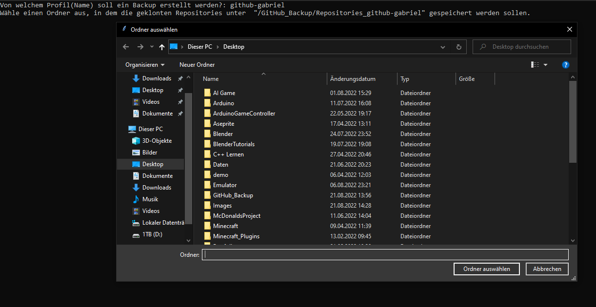
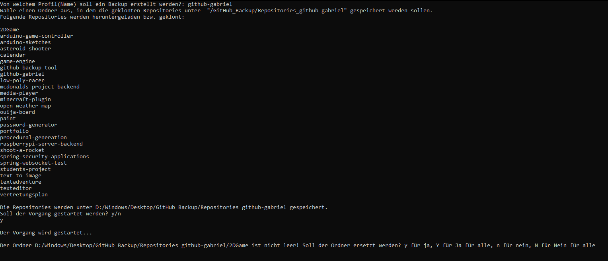
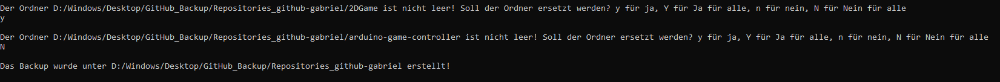
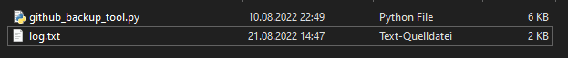
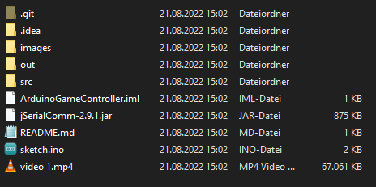

# GitHub Backup Tool
Das GitHub Backup Tool klont alle Repositories eines Users und speichert sie lokal in einem Ordner, den der User über einen
File Dialog bestimmt hat und der den Namen des Users trägt. Falls eines der Repositories eine README.md mit einer Verlinkung auf ein Video hat
wird auch dieses Video heruntergeladen. Das geht auch mit mehreren Videos, da das Programm, wenn der Name video {x}.mp4 ist x für jedes Video um 
1 inkrementiert.
### Zuerst muss der User den Speicherort festlegen. Das macht er über einen File Dialog der sich dann öffnet.

### Danach muss der User bestätigen, ob der Vorgang mit den aufgelisteten Repositories gestartet werden soll.

### Sollten die Ordner schon existieren, kriegt der User mehrere Optionen vorzugehen. Mit "y" kann er den bereits existierenden Ordner ersetzen, wohingegen er mit "n" bestätigt, dass dieser eine Ordner nicht ersetzt werden soll. Mit "Y" hat er die Möglichkeit alle Ordner zu ersetzen, im Gegensatz dazu kann er mit "N" das Ersetzen aller Ordner überspringen.

### Falls bei dem Backup Vorgang etwas schieflaufen sollte, werden Fehler in die log.txt geschrieben werden. Manche Fehler wie ```Cmd('git') failed due to: exit code(128)``` werden bei Klonversuchen auf schon existierende Ordner "erwartet" und entsprechend im Programm gehandhabt.

### Videos, die in der README.md stehen (wie in meinem [Arduino Game Controller Projekt](https://github.com/github-gabriel/arduino-game-controller)) werden automatisch von dem Tool gedownloaded. 


*Falls manche Sachen hier nicht erwähnt worden sind, liegt es daran, dass sie nicht verändert und wie in der v1 sind*

