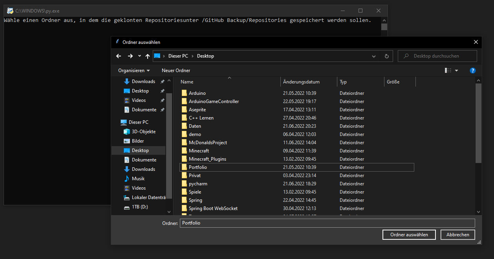

# Github Backup Tool
Das GitHub Backup Tool klont alle Repositories eines Users und speichert sie lokal in einem Ordner, den der User über einen
File Dialog bestimmt hat. 

### Zuerst muss der User den Speicherort festlegen. Das macht er über einen File Dialog der sich dann öffnet.
