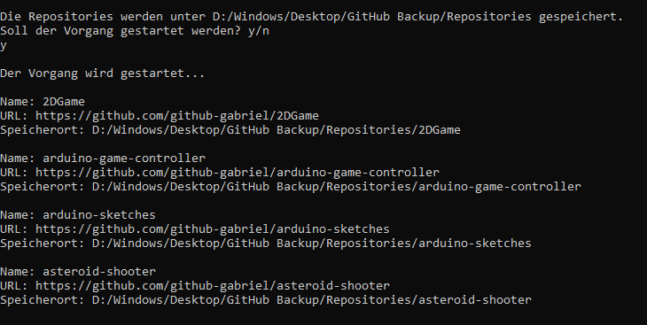

# GitHub Backup Tool v1
Das GitHub Backup Tool klont alle Repositories eines Users und speichert sie lokal in einem Ordner, den der User über einen
File Dialog bestimmt hat. 
### Zuerst muss der User den Speicherort festlegen. Das macht er über einen File Dialog der sich dann öffnet.

### Danach muss der User bestätigen, ob der Vorgang mit den aufgelisteten Repositories gestartet werden soll.

### Während dem Klonvergang werden auf der Konsole Informationen über die einzelnen Repositories ausgegeben.

### Am Ende wirst du unter ".../GitHub Backup/Repositories" die geklonten Repositories finden.

*Der neue Root Ordner ist "GitHub_Backup", anstatt "GitHub Backup"*
